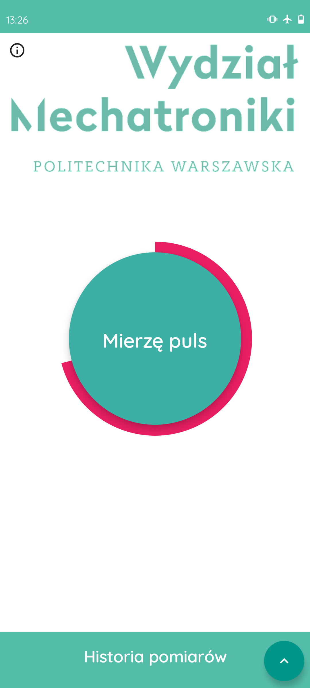
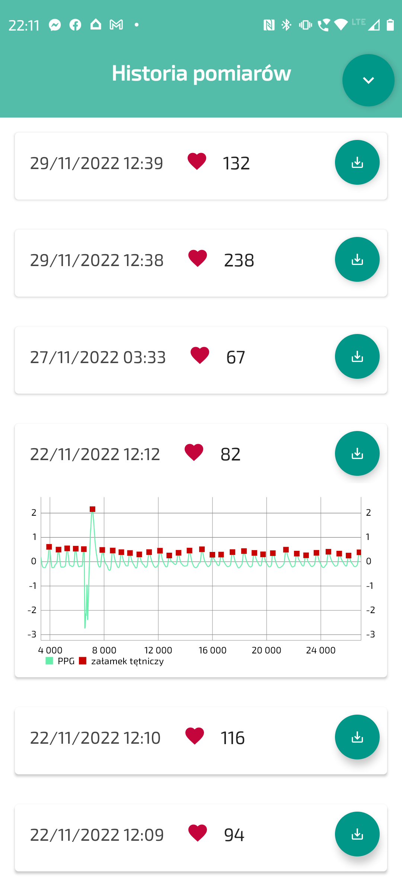

# Mierzo puls app
Android app that allows user to measure his pulse using in-build camera and lightning.
This project is part of an engineering thesis conducted at the Warsaw University of Technology.

## Technology stack

- Kotlin
- Jetpack Compose
- OpenCV
- Java Digital Signal Processing
- Koin

## Screenshots

|  |  |
|:--------------------------------------------:|:----------------------------------------:|

